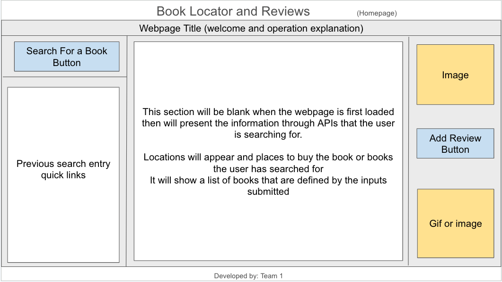
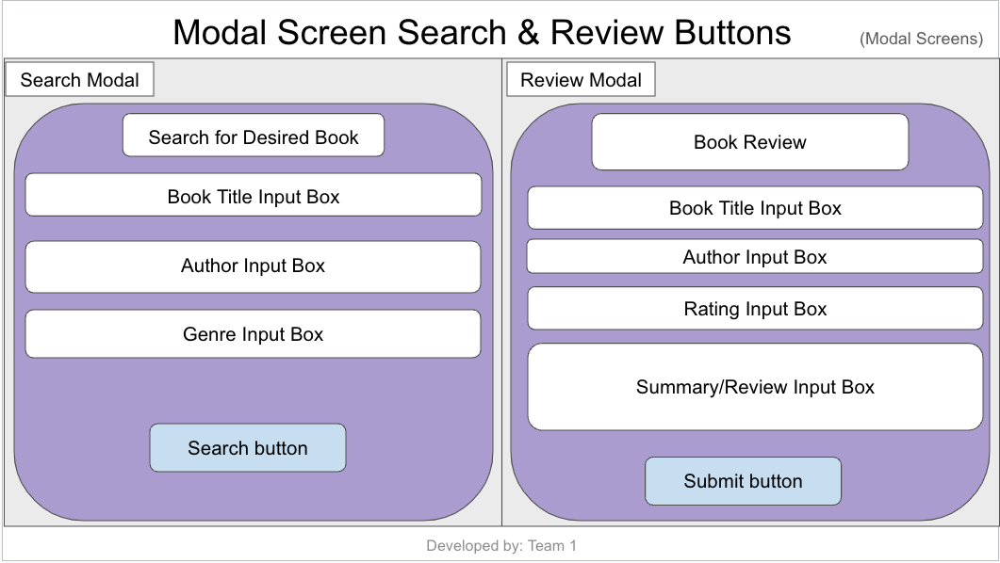
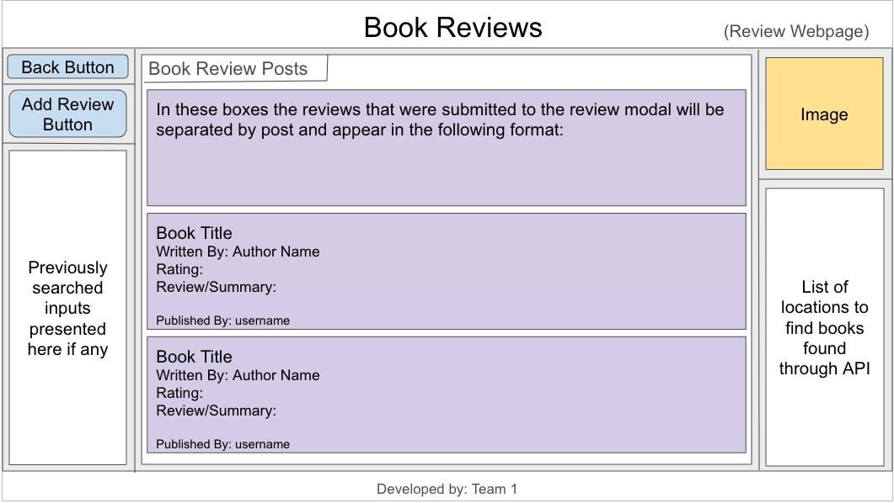

# Book Review Forum

## User Story
 
AS developers

WE Want to create a webpage

THAT allows the user to search for a variety of books that may be of interest to them and places in which to purchase them.

## Acceptance Criteria
    
* ITS done when the user is presented with a homepage that displays a button that will present the user with a modal once clicked

* ITS done when the user is presented with a form that allows them to fill in title, genre, and/or author

* ITS done when the user clicks the submit button and the information is placed within a localStorage 

* ITS done when the user is presented with reviews and locations to purchase the book after clicking the submit button

* ITS done when the search history is appended to the ___ side of the webpage

* (Adding a review submit and allow that to take them to a different screen/html) 

## Description 

## Images

Wireframe Layout
    
    
    

Index.html Imported Images

    
